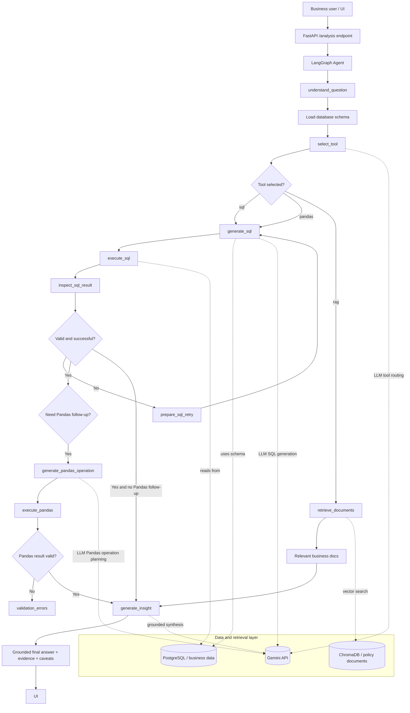

# Architecture diagram

## Flow summary

The graph begins with question understanding and route selection. The SQL path is the default path for structured business data. If the result requires more transformation, the agent moves into the Pandas branch. If the question depends on business policy or process documentation, the graph takes the RAG branch. The final insight node synthesizes all evidence into a concise business answer.
